# 建立 AR 專案操作教學

這份文件給第一次使用「承氣 WebAR 平台」的成員。照著流程走，可以從作品庫建立一個 AR 專案，上傳 Trigger Image，加入多個圖片/影片圖層，最後用手機掃描並錄影保存。

> 手機測試一定要用 HTTPS，例如 Netlify 網址或 tunnel 網址。手機不能開電腦上的 `localhost:5173`。

## 1. 進入作品庫

打開平台首頁後，會看到作品庫、資料夾分類和作品卡。點右上或作品區的「建立作品」開始。

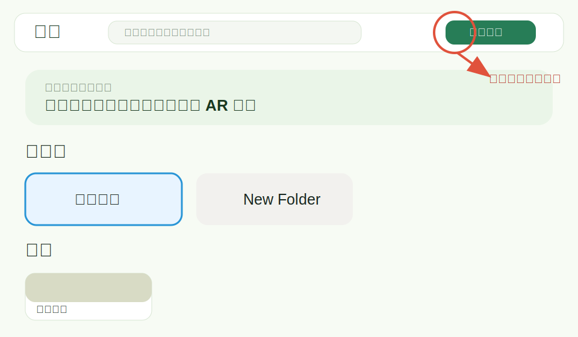

確認事項：

- 首頁品牌顯示「承氣」。
- 能看到既有作品卡與資料夾。
- 「建立作品」按鈕可以建立新的 AR project。

## 2. 建立並命名作品

輸入作品名稱，例如「清明 桐花 專案」。名稱會出現在作品卡、Editor、Viewer 和錄影檔名裡。

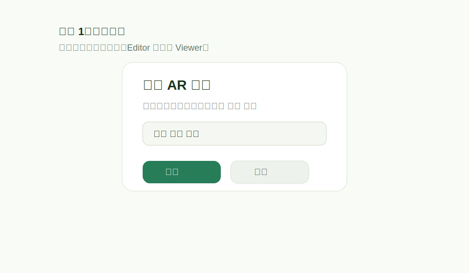

建議命名方式：

- 使用展覽或主題名稱。
- 加上節氣或花卉主題，方便之後分類。
- 不要只叫「test」或「未命名」，避免手機測試時找錯作品。

## 3. 認識 Editor 介面

進入 Editor 後，左側是素材與圖層設定，右側是 Three.js 3D 編輯畫布。Trigger Image 是基準平面，所有 AR 圖層會依照它的位置顯示。

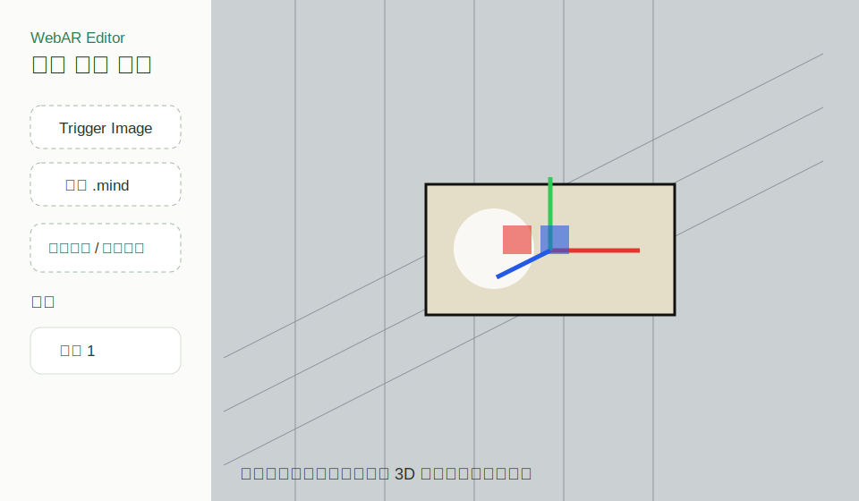

主要區塊：

- `Trigger Image`：上傳被手機掃描的圖片。
- `手動 .mind`：自動產生失敗時才需要手動補上。
- `新增圖片 / 影片圖層（可多選）`：一次加入多個 layer。
- `圖層列表`：選取、重新命名、顯示/隱藏、刪除 layer。
- `3D 畫布`：拖曳控制器調整位置、旋轉、縮放與深度。

## 4. 上傳 Trigger Image

點 `Trigger Image`，選擇一張清楚、有細節、對比足夠的圖片。這張圖之後會用來產生 `.mind`，也是手機鏡頭要掃描的目標。

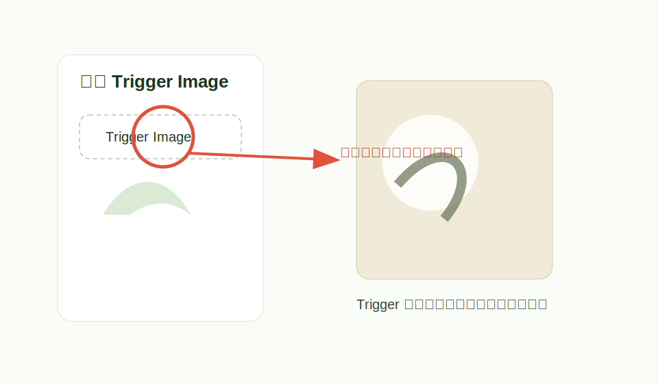

Trigger 圖片建議：

- 圖案細節越多越好，避免大面積純色。
- 不要使用太模糊、太反光或太暗的圖片。
- 手機掃描時請掃乾淨原圖，不要掃 Editor 畫布截圖。

## 5. 等待 `.mind ready`

Trigger Image 上傳後，系統會產生 MindAR 用的 `.mind` target。看到 `.mind ready` 後，代表 Viewer 可以進入圖片辨識流程。

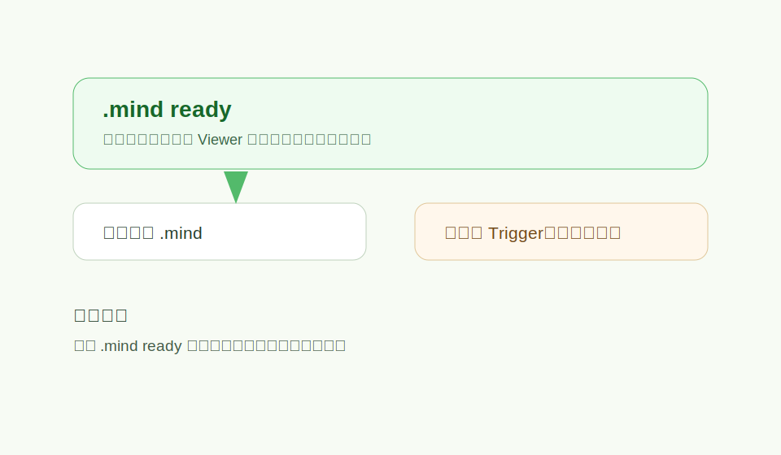

確認事項：

- Editor 左側或上方顯示 `.mind ready`。
- 如果換了 Trigger Image，請重新產生 `.mind`。
- 如果一直失敗，先換一張更清楚、尺寸較小的 Trigger Image。

## 6. 新增多個圖片 / 影片圖層

點 `新增圖片 / 影片圖層（可多選）`，可以一次選多個圖片或影片檔。每個檔案會自動變成一個 AR layer。

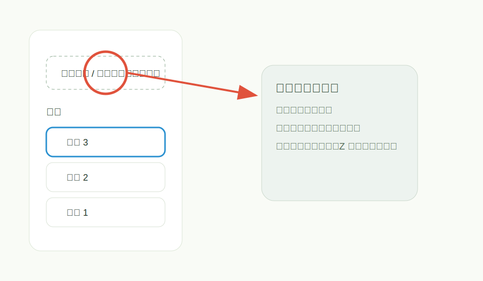

操作重點：

- 可混合上傳圖片與影片。
- 新增後會出現在圖層列表。
- 選取不同圖層後，左側設定和 3D 畫布會同步更新。

## 7. 調整圖層空間位置

選取圖層後，可以在 3D 畫布拖曳紅、綠、藍控制器，或直接在左側輸入數值。

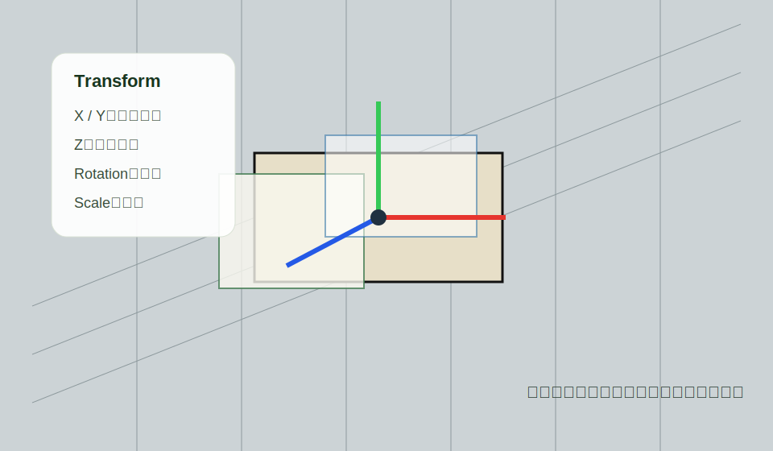

常用設定：

- `X / Y`：控制圖層在 Trigger 圖上的水平與垂直位置。
- `Z`：控制前後深度。Z 值不同，手機斜看時會有層次。
- `Rotation`：旋轉圖層。
- `Scale`：縮放圖層大小。
- `Opacity`：透明度。

## 8. 設定背景透明化

如果圖層素材有固定背景色，可以啟用色鍵去背。選擇要變透明的顏色，再調整 `Threshold` 和 `Softness`。

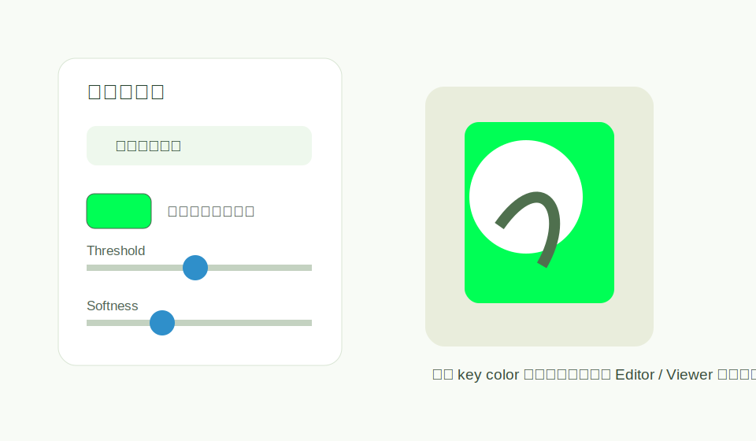

調整方式：

- `Color`：選擇要去掉的背景色。
- `Threshold`：數值越大，越多接近的顏色會被去掉。
- `Softness`：讓透明邊緣更柔和。
- Editor 和 Viewer 使用同一套 shader，效果會盡量一致。

## 9. 開啟乾淨 Trigger Image 頁

手機掃描前，先從 Editor 或 Viewer 開啟 `/target/:projectId`。這頁只顯示原始 Trigger Image，最適合拿來掃描。

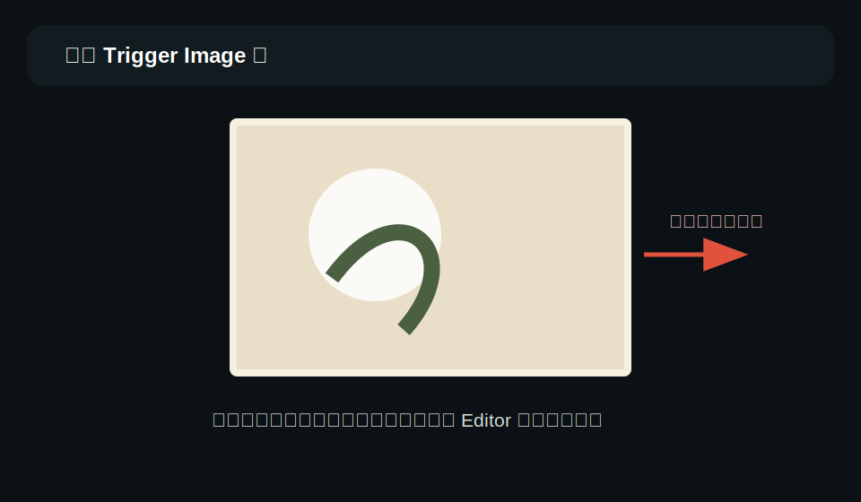

不要掃：

- Editor 3D 畫布。
- 已經被 AR 圖層覆蓋的截圖。
- 反光、歪斜太嚴重、距離太遠的螢幕畫面。

## 10. 用手機開 Viewer 並啟動 AR

手機開啟 `/viewer/:projectId`。如果是正式展示，請使用 Netlify HTTPS 網址；如果是本機測試，請先跑 tunnel。

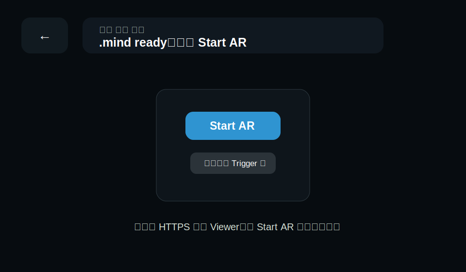

操作順序：

1. 手機開 Viewer URL。
2. 點 `Start AR`。
3. 允許相機權限。
4. 對準 `/target/:projectId` 的乾淨 Trigger Image。
5. 辨識成功後，會顯示你在 Editor 配好的多圖層 AR 效果。

## 11. 掃描成功後檢查 AR 效果

掃到 Trigger Image 後，Viewer 會把專案 layers 直接掛到 MindAR anchor 上，顯示平台內設定好的圖層效果。

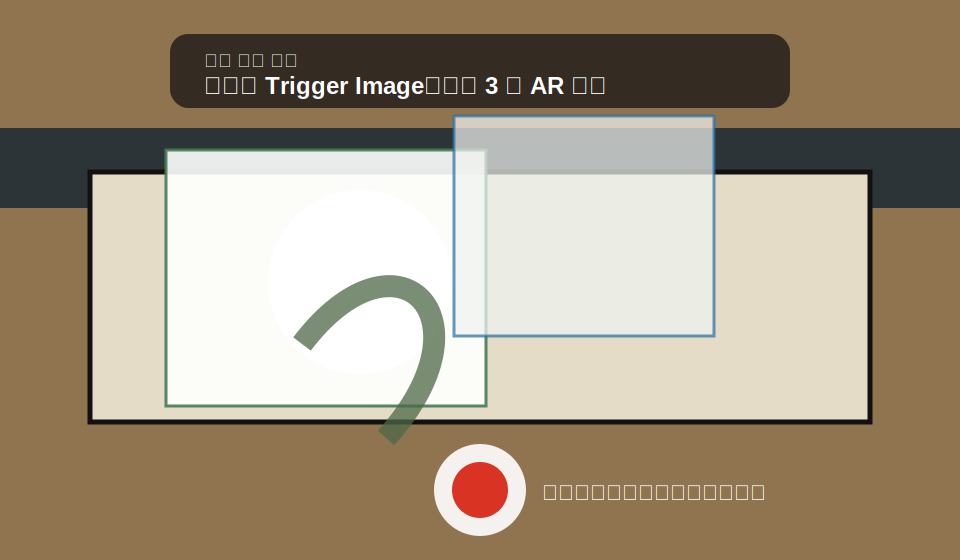

確認事項：

- 圖層數量正確。
- 圖片/影片都能顯示。
- Z 深度與前後層次符合 Editor 預覽。
- 透明去背效果看起來正常。
- 如果掃不到，請回到 Target 頁掃乾淨 Trigger 圖。

## 12. 錄影並保存到手機

AR 畫面出現後，按紅色錄影按鈕開始錄製；再按一次停止。停止後會產生影片，依手機瀏覽器支援情況下載或打開分享面板。

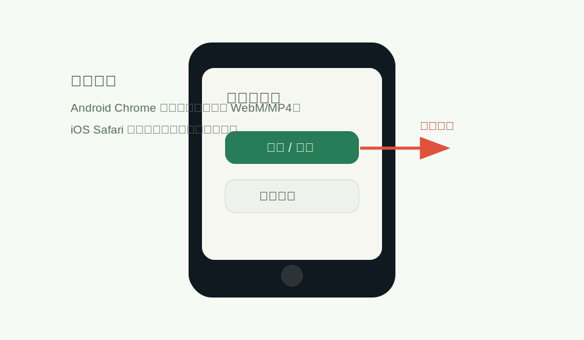

注意事項：

- Android Chrome 通常最穩。
- iOS Safari 的錄影、下載、分享支援會依版本不同。
- 如果素材跨網域 CORS 不允許錄影合成，AR 播放仍可用，但錄影可能顯示錯誤。

## 快速檢查表

- 已建立作品並命名。
- 已上傳 Trigger Image。
- Editor 顯示 `.mind ready`。
- 已新增圖片或影片圖層。
- 已調整 X / Y / Z / Rotation / Scale。
- 已設定需要的透明去背。
- 手機使用 HTTPS Viewer URL。
- 掃描 `/target/:projectId` 的乾淨 Trigger Image。
- AR 圖層出現後再開始錄影。
