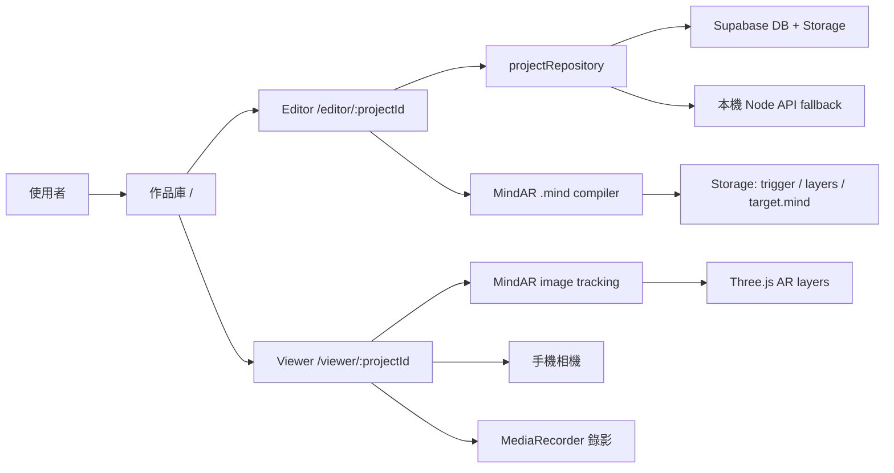
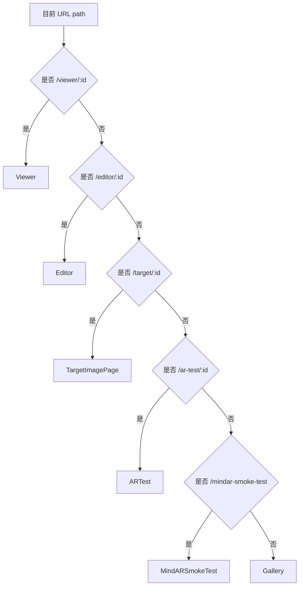
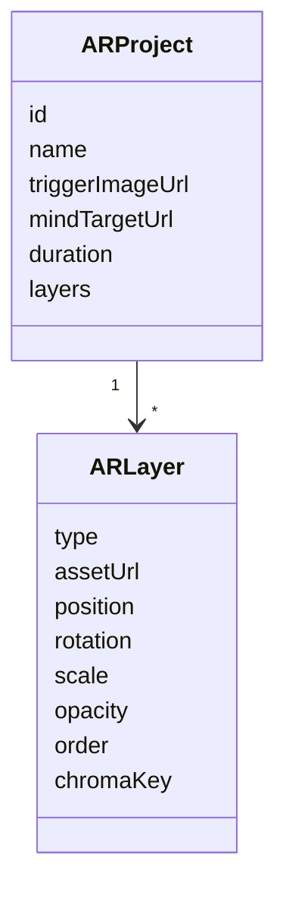
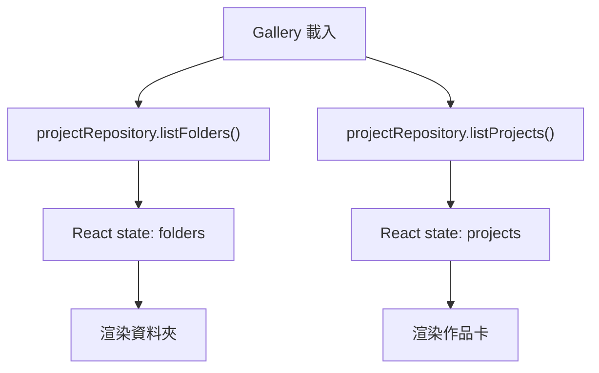
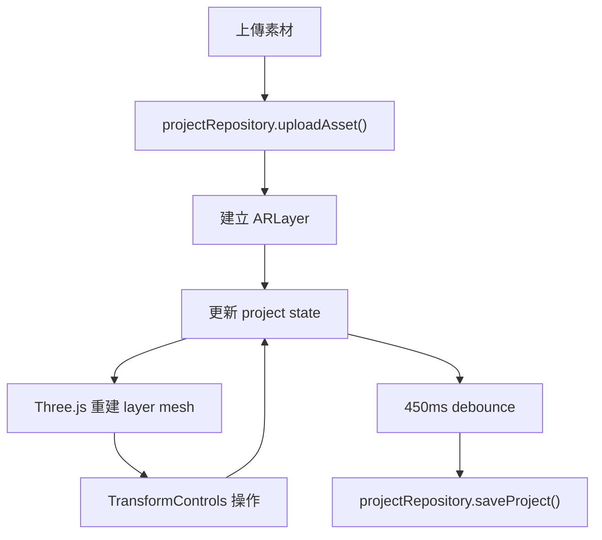
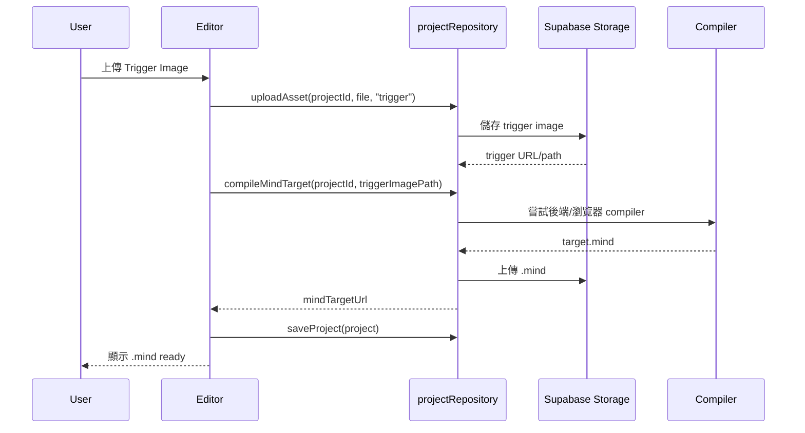
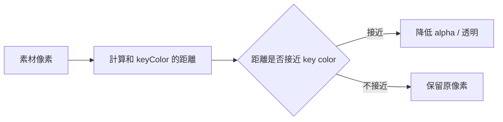
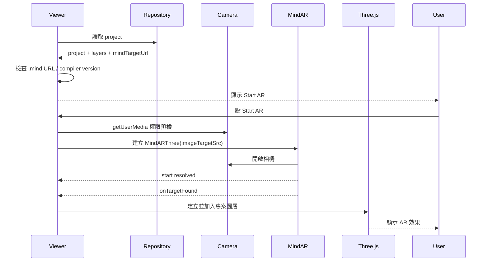
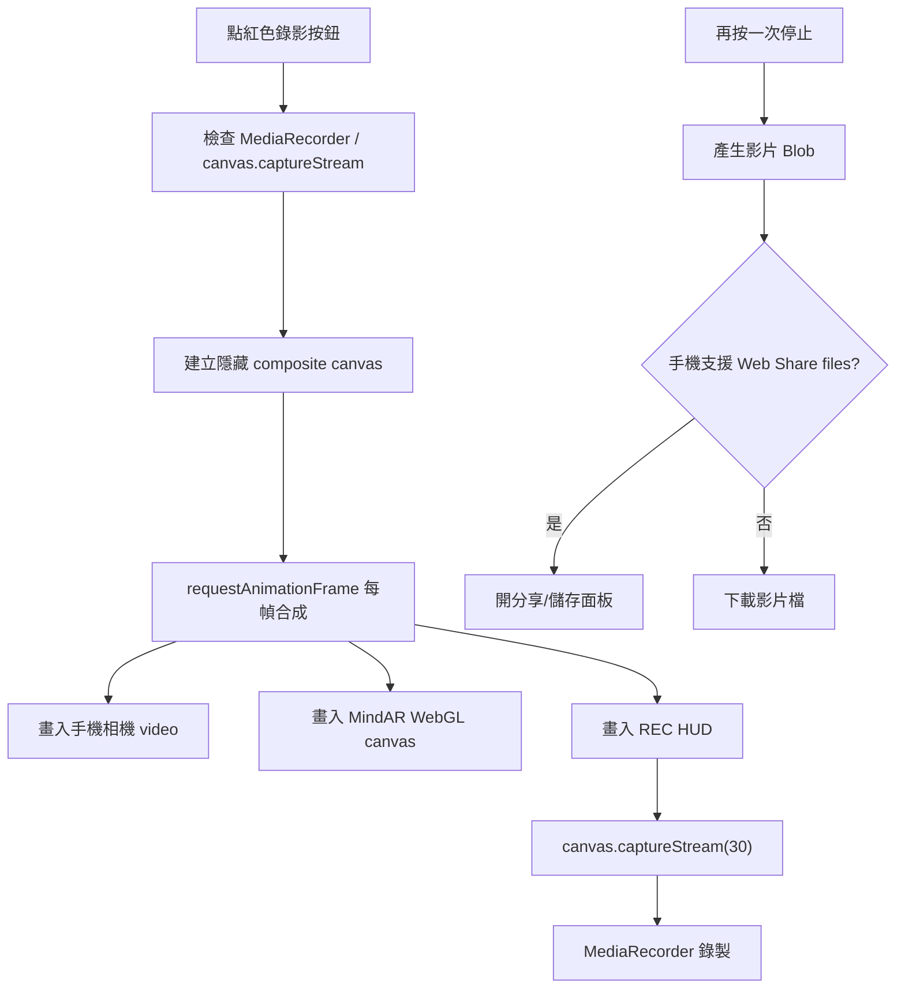
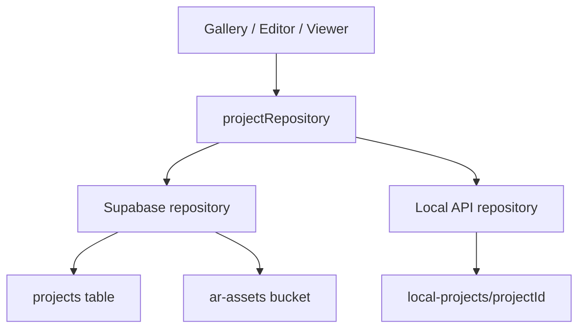

# 承氣 WebAR 平台運作說明

這份文件是給開發者和未來的你看的：它不是使用手冊，而是解釋「這個影像觸發式 WebAR 多圖層平台是怎麼運作的」。

目前系統的核心目標是：

- 使用者在作品庫建立自己的 AR 專案。
- 在 Editor 裡上傳 Trigger Image、圖片/影片圖層，調整位置、旋轉、縮放、透明度、色鍵去背和時間軸。
- 系統產生 `.mind` 影像追蹤檔。
- 手機 Viewer 開相機掃描 Trigger Image，顯示使用者設計好的多圖層 AR 效果。
- Viewer 可錄製相機畫面加 AR 圖層，透過手機分享或下載保存影片。

## 一、整體架構



前端是 Vite + React + TypeScript。3D 和 AR 顯示使用 Three.js，影像辨識使用 MindAR。資料存取透過 `projectRepository` 包起來，所以之後要把本機儲存換成 Supabase 或其他後端時，Editor/Viewer 不需要大改。

## 二、主要路由

路由集中在 `src/App.tsx`，用 `window.location.pathname` 判斷目前頁面。



各頁功能：

- `/`：作品庫首頁，顯示資料夾和作品卡。
- `/editor/:projectId`：AR 編輯器。
- `/viewer/:projectId`：手機 AR 掃描 Viewer。
- `/target/:projectId`：乾淨 Trigger Image 頁，給手機掃描用。
- `/ar-test/:projectId`：用同一套專案圖層做最小 AR 測試。
- `/mindar-smoke-test`：MindAR 官方類型的 runtime 測試頁，用來排除是否是手機瀏覽器或引擎問題。

## 三、資料結構

主要型別在 `src/types/project.ts`。

### ARProject

一個 AR 專案包含：

- `id`：專案 ID。
- `folderId`：所屬資料夾。
- `name`：專案名稱。
- `triggerImageId` / `triggerImageUrl`：觸發圖。
- `mindTargetId` / `mindTargetUrl`：MindAR 的 `.mind` 追蹤檔。
- `mindCompilerVersion`：產生 `.mind` 的 MindAR 版本，目前用 `mind-ar@1.2.5`。
- `duration`：時間軸長度。
- `layers`：多個圖片或影片圖層。

### ARLayer

每個圖層包含：

- `type`：`image` 或 `video`。
- `assetId` / `assetUrl`：素材位置。
- `position`：3D 位置，含 `z` 深度。
- `rotation`：旋轉。
- `scale`：縮放。
- `opacity`：透明度。
- `visible`：是否顯示。
- `order`：圖層順序。
- `startTime` / `endTime` / `loop`：時間軸設定。
- `chromaKey`：色鍵去背設定。



## 四、作品庫 Gallery

主要檔案：`src/components/Gallery.tsx`

Gallery 是作品庫工作區：

- 顯示品牌「承氣」。
- 顯示資料夾列表。
- 顯示作品卡。
- 建立新資料夾。
- 建立新 AR project。
- 作品卡可進 Editor 或 Viewer。
- 三點選單支援編輯、管理 WebAR、下載 JSON、刪除單一作品。

資料來源都走 `projectRepository`：



這樣 Gallery 不需要知道資料是從 Supabase 還是本機 API 來。

## 五、Editor 編輯器

主要檔案：`src/components/Editor.tsx`

Editor 做三件大事：

1. 管理專案資料。
2. 建立 Three.js 3D 編輯畫布。
3. 自動保存到 repository。

### Editor 畫面

左側是設定面板：

- Trigger Image 上傳。
- 手動 `.mind` fallback 上傳。
- 多檔圖片/影片圖層上傳。
- 圖層列表。
- Transform 數值。
- Opacity。
- Chroma key 色鍵去背。
- Timeline。

右側是 Three.js 3D 預覽：

- Trigger Image 是基準平面。
- 圖層是可拖拉的 3D plane。
- `TransformControls` 提供紅綠藍軸控制器。
- `OrbitControls` 讓使用者旋轉視角，看側面圖層深度。



### 自動保存

Editor 裡只要 project state 變了，就會延遲約 450ms 自動保存。這避免每拖一下就立刻打後端，同時也讓使用者不需要一直按 save。

## 六、Trigger Image 和 `.mind`

相關檔案：

- `src/ar/mindCompiler.ts`
- `src/ar/mindVersion.ts`
- `netlify/functions/compile-mind-target.ts`
- `supabase/functions/compile-mind-target/index.ts`

MindAR 需要 `.mind` 檔才能辨識圖片。平台流程是：



目前實務上，最可靠的是讓 Editor 產生或重建 `.mind`，並保存 `mindCompilerVersion`。Viewer 會檢查 `.mind` 是否是目前版本，避免舊版 `.mind` 和 runtime 不相容。

## 七、Three.js 圖層與色鍵去背

Editor 用的是：

- `src/three/layerMesh.ts`
- `src/three/chromaKeyMaterial.ts`

Viewer / AR runtime 用的是：

- `src/ar/runtimeLayerMesh.ts`

兩邊都把圖片/影片變成 Three.js 的 plane，再套 shader material。

### 色鍵去背的概念

Chroma key 會比較每個像素和指定顏色的距離：

- 距離很近：變透明。
- 距離超過 threshold：保留。
- softness：讓透明邊緣柔和，不會太硬。



## 八、手機 Viewer 掃描 AR

主要檔案：

- `src/components/Viewer.tsx`
- `src/ar/projectMindARSession.ts`
- `src/ar/mindRuntime.ts`
- `src/ar/runtimeLayerMesh.ts`

Viewer 啟動流程：



### 為什麼要先顯示 Start AR

iOS 和 Android 瀏覽器通常要求相機/影片播放必須由使用者點擊觸發，所以不能進頁面就自動開相機。`Start AR` 是必要的使用者手勢。

### 側面圖層深度

Editor 的每個 layer 都有 `position.z`。Viewer 顯示時會再套一個手機端 `depthBoost`：

- 保留使用者在 Editor 設定的前後關係。
- 把太接近的層拉開一點。
- 讓手機斜看或左右移動時，可以看出圖層前後堆疊。

相關程式在 `src/ar/runtimeLayerMesh.ts`：

- `applyRuntimeLayerTransform()`：把 layer 的 position / rotation / scale 套到 Three.js mesh。
- `depthBoost`：放大 z 深度。
- `minimumDepth`：如果舊專案 z 太接近，就依 order 補一點間距。

## 九、真錄影功能

主要檔案：`src/components/Viewer.tsx`

瀏覽器不能直接「把畫面存進相簿」，但可以錄成影片 Blob，再讓使用者分享或下載。

目前錄影流程：



### 為什麼要用 composite canvas

手機畫面其實分成兩層：

- 相機 video。
- AR WebGL canvas。

如果只錄其中一層，影片就不完整。所以 Viewer 建立一個隱藏 canvas，把兩層每一幀合成成一張畫面，再錄這張合成畫面。

### 錄影限制

- Android Chrome 通常支援 `video/webm` 最穩。
- iOS Safari 對錄影/下載/分享支援會因版本不同而不同。
- 如果素材跨網域沒有 CORS，瀏覽器可能禁止把它畫進錄影 canvas。這時 AR 播放仍可用，但錄影會顯示錯誤。

## 十、Repository 資料層

主要檔案：

- `src/data/projectRepository.ts`
- `src/data/supabaseProjectRepository.ts`
- `src/data/hydrateRuntimeProject.ts`
- `server/index.ts`

`projectRepository` 是前端唯一該接觸的資料入口。它負責決定要用：

- Supabase backend。
- 本機 Node API fallback。
- local/mock 行為。

`hydrateRuntimeProject()` 會把 project JSON 裡的 asset id 轉成 Viewer/Editor 真正能用的 public URL。



## 十一、Netlify 部署

主要檔案：

- `netlify.toml`
- `netlify/functions/compile-mind-target.ts`

Netlify 主要做：

- 靜態前端部署。
- SPA redirect，讓 `/editor/:id`、`/viewer/:id` 直接刷新也能開。
- Netlify Function API，例如 `/api/compile-mind-target`。

Production URL：

```text
https://bang287-ar-app.netlify.app
```

## 十二、開發常用指令

```bash
npm run dev
npm run build
npm audit --audit-level=moderate
npm run tunnel
```

手機測試一定要用 HTTPS：

- Netlify：最穩。
- Cloudflare tunnel：本機快速測試。
- `localhost`：手機不能用，因為手機的 localhost 是手機自己，不是你的電腦。

## 十三、如果後續要加強

建議優先順序：

1. 讓 `.mind` compiler 後端化更穩定，不依賴瀏覽器。
2. 加登入和使用者權限。
3. 加專案版本管理，避免誤改作品。
4. 錄影加入倒數、暫停、重新錄製。
5. Editor 加吸管工具，直接從素材取色做 chroma key。
6. 圖層支援 3D model / audio / text layer。
7. 加圖層側面預覽模式，讓使用者不用拿手機也能看空間深度。
